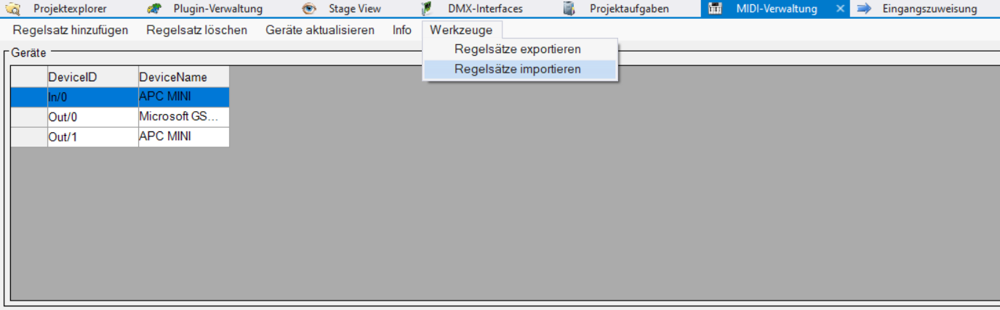
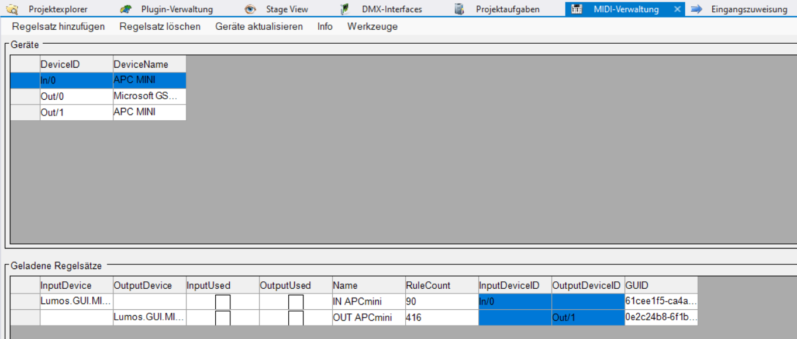
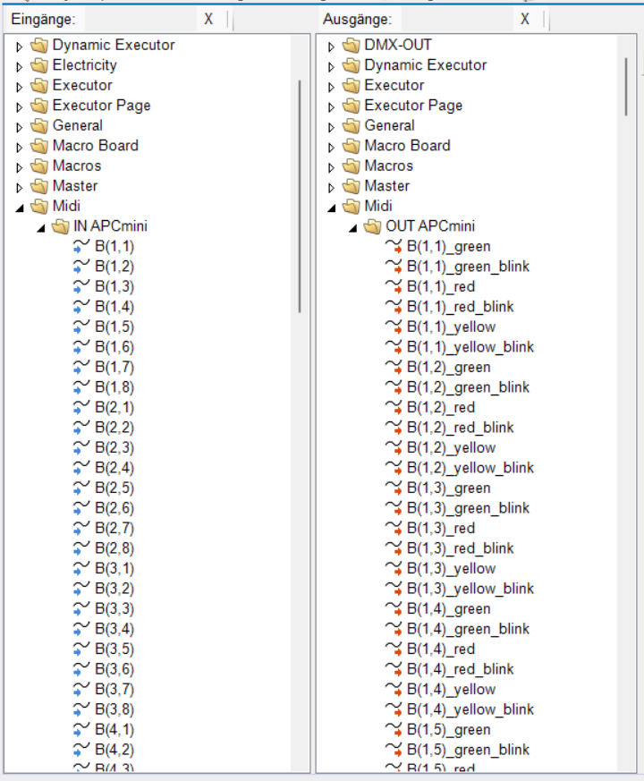

= APCmini XML Generator for DMX Control 3

== Introduction
This project provides a Python script to generate an XML configuration file (`apcmini.xml`) for the APCmini MIDI controller to use with DMX Control 3.

== Prerequisites
- Python 3.x
- APCmini MIDI controller
- DMX Control 3 software
- MIDO Python library

== Usage
1. Clone the repository.
2. Navigate to the project directory.
3. Run the `APCmini.py` script with Python.

```sh
python APCmini.py
```

== In DMX Control 3





